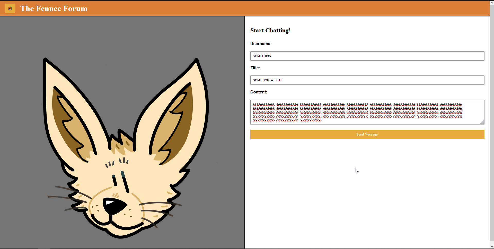
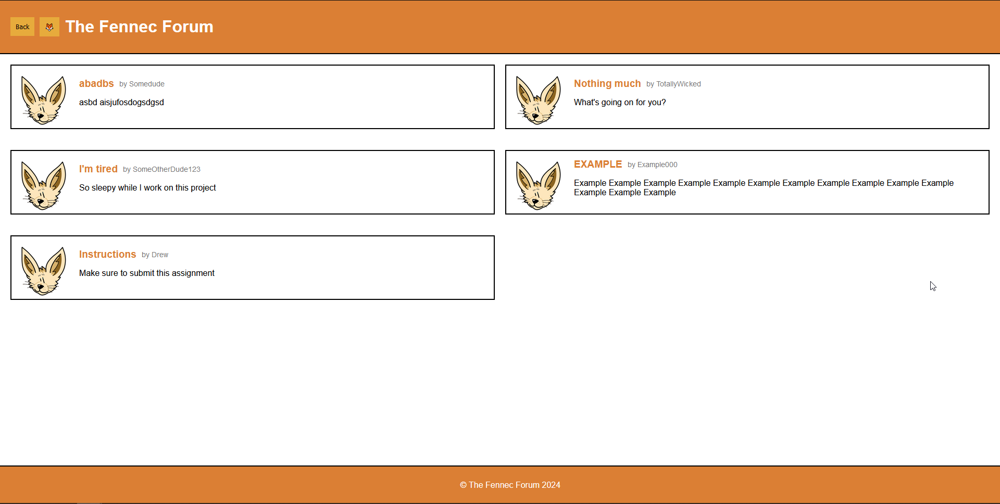

# Web API Challenge: Personal Blog

## Goal: Create a two-page website for blog posts
This repository should show that I can properly create more than just a web page, but a web app. It contains:
- A landing page with form inputs
- A blog page that displays content submitted on those forms
- Multiple JavaScript files for handling logic between files
- A button that toggles between a dark and light theme

## Acceptance Criteria
- GIVEN a personal blog
- WHEN I load the app,
- THEN I am presented with the landing page containing a form with labels and inputs for username, blog title, and blog content.
- WHEN I submit the form,
- THEN blog post data is stored to localStorage.
- WHEN the form submits,
- THEN I am redirected to the posts page.
- WHEN I enter try to submit a form without a username, title, or content,
- THEN I am presented with a message that prompts me to complete the form.
- WHEN I view the posts page,
- THEN I am presented with a header, with a light mode/dark mode toggle, and a "Back" button.
- WHEN I click the light mode/dark mode toggle,
- THEN the page content's styles update to reflect the selection.
- WHEN I click the "Back" button,
- THEN I am redirected back to the landing page where I can input more blog entries.
- WHEN I view the main content,
- THEN I am presented with a list of blog posts that are pulled from localStorage.
- WHEN I view localStorage,
- THEN I am presented with a JSON array of blog post objects, each including the post author's username, title of the post, and post's content.
- WHEN I take a closer look at a single blog entry in the list,
- THEN I can see the title, the content, and the author of the post.
- WHEN I view the footer,
- THEN I am presented with a link to the developer's portfolio.

## Deployed Web Page
You can find the deployed web page for this project [here!](https://deceitfuldragon.github.io/personal-api-blog/)

## Images
The fennec fox art used on this page is of my own creation and belongs to me.